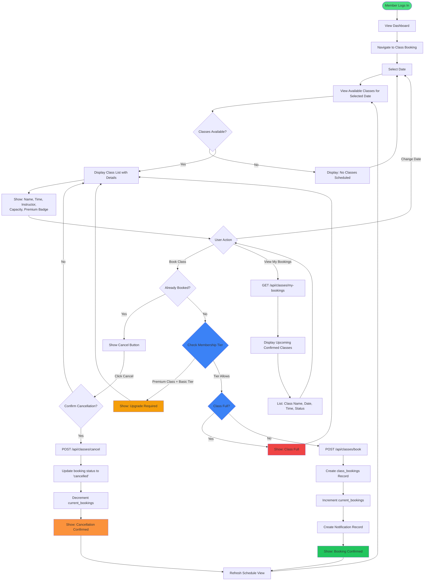

# Class Booking System - User Flow Diagram

This document illustrates the complete user flow for Sub-project 3: Class & Personal Training Booking System.

## User Flow Diagram

## Key Features

### 1. Browse Classes
- User selects a date (default: today, up to 7 days ahead)
- System displays all scheduled classes for that date
- Each class shows: name, description, instructor, time, capacity, and premium status

### 2. Membership Tier Validation
- **Basic Tier**: Can book up to 8 regular classes per month
- **Premium Tier**: Can book up to 20 classes per month, including premium classes
- **VIP Tier**: Unlimited bookings, including all premium classes

### 3. Capacity Management
- Real-time capacity tracking prevents overbooking
- Shows current bookings vs. total capacity (e.g., "15/20")
- Disables booking button when class is full

### 4. Book a Class
1. User clicks "Book" on available class
2. System validates membership tier (premium class access)
3. System checks available capacity
4. Creates booking record in database
5. Increments current bookings counter
6. Creates notification for confirmation
7. Updates UI to show "Cancel" button

### 5. View My Bookings
- Displays all upcoming confirmed class bookings
- Shows class name, date, time, and confirmation status
- Sorted chronologically

### 6. Cancel Booking
1. User clicks "Cancel" on booked class
2. System confirms cancellation intent
3. Updates booking status to 'cancelled'
4. Decrements current bookings counter
5. Frees up spot for other members
6. Updates UI to show "Book" button again

## API Endpoints

### GET /api/classes/schedules
- **Purpose**: Fetch class schedules for a specific date
- **Query Params**: `date` (optional, format: YYYY-MM-DD)
- **Response**: Array of class schedules with availability info

### GET /api/classes/my-bookings
- **Purpose**: Get user's confirmed bookings
- **Auth**: Requires user_id
- **Response**: Array of booking records with full class details

### POST /api/classes/book
- **Purpose**: Create a new class booking
- **Body**: `{user_id, schedule_id}`
- **Validation**: 
  - Membership tier access
  - Class capacity
  - No duplicate bookings
- **Response**: Booking confirmation with details

### POST /api/classes/cancel
- **Purpose**: Cancel an existing booking
- **Body**: `{user_id, booking_id}`
- **Validation**: User owns the booking
- **Response**: Cancellation confirmation

## Integration Points

### Sub-project 1: User Registration & Membership Portal
- Reads `membership_subscriptions` table to get user's current tier
- Validates tier permissions for premium class access

### Sub-project 6: Notification & Announcement System
- Creates notification records upon successful booking
- Placeholder for email/SMS confirmations (to be implemented by Sub-project 6)

### Sub-project 2: Member Dashboard
- Dashboard displays upcoming bookings from this system
- Shows booking count vs. membership tier limits

## Database Tables Used

### fitness_classes
- Stores class templates (Yoga, Spin, HIIT, etc.)
- Contains: name, description, instructor, duration, capacity, is_premium

### class_schedules
- Specific class instances with date/time
- Tracks: scheduled_date, start_time, end_time, current_bookings, status

### class_bookings
- Member reservations for classes
- Stores: user_id, schedule_id, status, booked_at, cancelled_at
- UNIQUE constraint on (user_id, schedule_id) prevents double-booking

### membership_subscriptions
- Links users to their membership tier
- Contains: user_id, tier_id, status, renewal_date

### membership_tiers
- Defines Basic, Premium, and VIP tiers
- Includes: max_classes_per_month, can_book_premium_classes

### notifications
- System notifications for booking confirmations
- Stores: user_id, title, message, type, is_read

## Business Rules

1. **Prevent Overbooking**: Check `current_bookings < capacity` before allowing booking
2. **Tier Restrictions**: Premium classes require Premium or VIP membership
3. **No Duplicate Bookings**: Database constraint prevents same user booking same class twice
4. **Atomic Updates**: Booking creation and counter increment happen together
5. **Soft Delete**: Cancellations update status rather than deleting records
6. **Real-time Availability**: UI refreshes after every booking/cancellation

